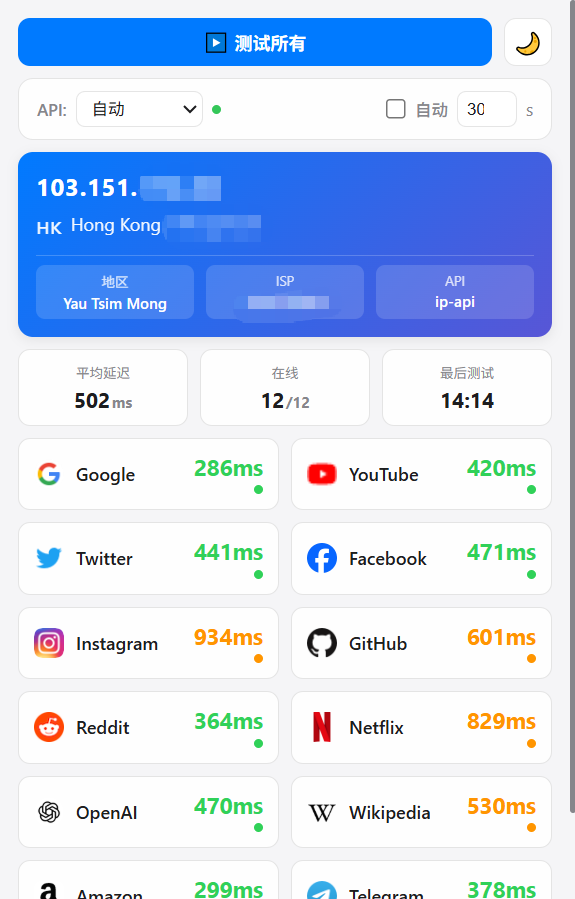

一个用于检测常用国外网站访问延迟的Chrome浏览器插件,帮助您快速判断VPN连接质量。

## 界面展示

<div align="center">
  
</div>

## 功能特点

### 🌐 多网站延迟检测
- 支持12个常用国外网站的延迟测试
- 包括: Google, YouTube, Twitter, Facebook, Instagram, GitHub, Reddit, Netflix, OpenAI, Wikipedia, Amazon, Telegram
- 实时显示延迟数值和连接状态
- 颜色编码状态指示(绿色=优秀, 黄色=一般, 红色=较差)

### 🔐 VPN出口IP检测
- 自动检测当前VPN出口IP地址
- 显示IP所在国家、城市、地区
- 显示ISP提供商和时区信息
- 支持5个IP检测API渠道:
  - ipapi.co
  - ipinfo.io
  - ip-api.com
  - Cloudflare
  - ipify.org

### 🔄 智能API切换
- 自动选择可用的API渠道
- API失败时自动切换到备用渠道
- 支持手动选择特定API
- 实时API状态指示

### ⚙️ 自定义设置
- 自动刷新功能(5-300秒可调)
- 深色/浅色主题切换
- 单个网站独立测试
- 一键测试所有网站

### 📊 实时统计
- 平均延迟计算
- 在线网站数量统计
- 最后测试时间显示

## 安装方法

### 方法一: 开发者模式安装(推荐)

1. **下载插件文件**
   - 下载整个 `chrome-extension` 文件夹

2. **打开Chrome扩展管理页面**
   - 在Chrome地址栏输入: `chrome://extensions/`
   - 或者: 菜单 → 更多工具 → 扩展程序

3. **启用开发者模式**
   - 在页面右上角打开"开发者模式"开关

4. **加载插件**
   - 点击"加载已解压的扩展程序"
   - 选择 `chrome-extension` 文件夹
   - 点击"选择文件夹"

5. **完成安装**
   - 插件图标会出现在Chrome工具栏
   - 点击图标即可使用

### 方法二: 打包安装

1. 在扩展管理页面点击"打包扩展程序"
2. 选择 `chrome-extension` 文件夹
3. 生成 `.crx` 文件
4. 拖拽 `.crx` 文件到扩展管理页面安装

## 使用说明

### 基本操作

1. **打开插件**
   - 点击Chrome工具栏的插件图标
   - 弹出窗口显示检测界面

2. **检测IP信息**
   - 插件自动检测VPN出口IP
   - 显示IP地址、国家、城市等信息
   - 点击"🔄"按钮可手动刷新

3. **测试网站延迟**
   - 点击"测试所有"按钮测试全部网站
   - 或点击单个网站卡片单独测试
   - 查看延迟数值和状态指示

4. **切换API渠道**
   - 默认使用"自动"模式
   - 可手动选择特定API渠道
   - 绿点=成功, 黄点=加载中, 红点=失败

5. **启用自动刷新**
   - 勾选"自动刷新"复选框
   - 设置刷新间隔(5-300秒)
   - 插件会定期自动测试

6. **切换主题**
   - 点击右上角月亮/太阳图标
   - 切换深色/浅色主题

### 延迟评级标准

| 延迟范围 | 状态 | 颜色 | 说明 |
|---------|------|------|------|
| < 200ms | 优秀 | 🟢 绿色 | 连接极佳 |
| 200-500ms | 良好 | 🟢 绿色 | 连接良好 |
| 500-1000ms | 一般 | 🟡 黄色 | 可以使用 |
| > 1000ms | 较差 | 🔴 红色 | 连接缓慢 |
| 超时 | 离线 | ⚫ 灰色 | 无法连接 |

## 技术说明

### 文件结构
```
chrome-extension/
├── manifest.json       # 插件配置文件
├── popup.html         # 弹出窗口HTML
├── popup.css          # 样式文件
├── popup.js           # 主要逻辑
├── background.js      # 后台服务
├── icons/             # 图标文件夹
│   ├── icon16.png
│   ├── icon48.png
│   └── icon128.png
└── README.md          # 说明文档
```

### 权限说明

插件需要以下权限:

- `storage`: 保存用户设置(主题、API选择等)
- `host_permissions`: 访问网站进行延迟测试和IP检测

### 延迟检测原理

1. **主要方法**: 使用 `fetch()` API请求网站favicon
2. **备用方法**: 使用 `Image` 对象加载图标
3. **超时设置**: 10秒超时限制
4. **并行测试**: 同时测试多个网站提高效率

### IP检测机制

1. **多渠道支持**: 5个不同的IP检测API
2. **智能切换**: 优先使用上次成功的API
3. **自动重试**: API失败时自动尝试下一个
4. **超时控制**: 每个API 5秒超时

## 隐私说明

- ✅ 所有数据仅在本地处理
- ✅ 不收集或上传任何用户信息
- ✅ IP检测通过第三方公开API进行
- ✅ 设置保存在浏览器本地存储
- ✅ 无需注册或登录

## 常见问题

### Q: 为什么有些网站显示"超时"?
A: 可能原因:
- VPN未连接或连接不稳定
- 网站在您的地区被屏蔽
- 网络连接速度较慢
- 网站服务器暂时不可用

### Q: 为什么IP检测失败?
A: 可能原因:
- 所有IP检测API都被墙或不可用
- 网络连接问题
- 尝试手动切换其他API渠道

### Q: 延迟数值为什么不准确?
A: 说明:
- 延迟受网络状况实时影响
- 建议多次测试取平均值
- 不同时间段结果可能不同

### Q: 插件占用资源多吗?
A: 资源占用:
- 仅在打开时运行
- 关闭弹窗后停止测试
- 自动刷新会持续运行

### Q: 如何更新插件?
A: 更新方法:
- 下载新版本文件
- 在扩展管理页面点击"重新加载"
- 或删除旧版本重新安装

## 注意事项

1. **API限制**: 免费IP检测API有请求频率限制,避免过于频繁刷新
2. **网络环境**: 需要VPN才能访问被墙网站
3. **浏览器版本**: 需要Chrome 88或更高版本
4. **CORS限制**: 某些网站可能无法直接测试延迟

## 更新日志

### v1.0.0 (2025-11-19)
- ✨ 初始版本发布
- ✅ 支持12个网站延迟检测
- ✅ 5个IP检测API渠道
- ✅ 智能API自动切换
- ✅ 自定义刷新时间
- ✅ 深色/浅色主题

## 反馈与支持

如有问题或建议,欢迎反馈!

## 许可证

MIT License

---
